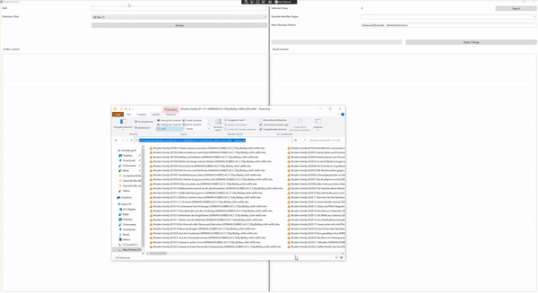

# Introduction 
ShowRenamer is a small, kind of hacky .NET Core WPF Tool for renaming files based on a regex and the [TMDB API](https://developers.themoviedb.org/3/getting-started/introduction).

# Building and running
You need .NET Core 3.1 to build the project.
Before you run the project for the first time, the [TDMB Bearer Token](https://developers.themoviedb.org/3/getting-started/authentication) has to be replaced in the [appsettings](./src/ShowRenamer/appsettings.json).

# Regex and Filename pattern
The regex needs to have the following three capture groups:
| Capture Group Name | Usage |
|------|---|
| Episode | Identifies the episode number in the current season |
| Season | Identifies the season number |
| Extension | The file extension |

The filename pattern can then use the name of the capture groups above to create a new filename, additionaly with the param *Name* the episodes name can be used.